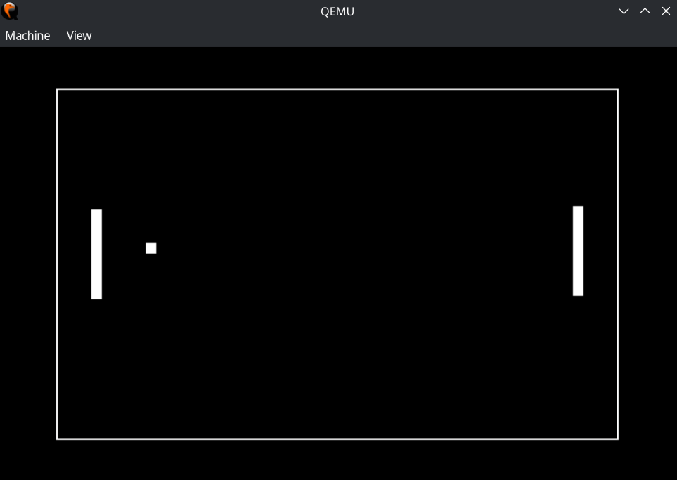
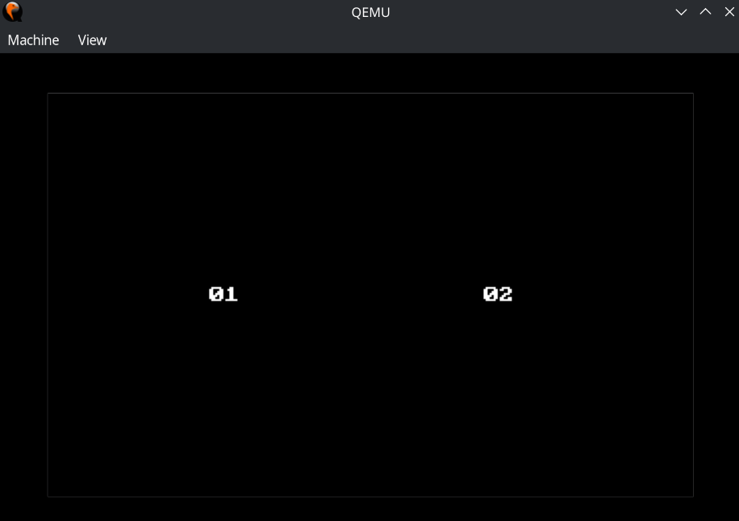

# bootloader-tennis
A primitive tennis-like game written as an entirely self-contained 512 byte Master Boot Record (MBR) to be loaded and ran by any system BIOS.

# Images 
<table>
  <tr>
    <td valign="top" width="33%">
      
    </td>
    <td valign="top" width="33%">
      
    </td>
  </tr>
</table>

# Features
- Includes a boot signature, can be read by a real BIOS.
- Entirely self contained, does not load any additional code. Highly space-optimised assembly that fits entirely within the 512 byte MBR boot sector.
- Uses '13h' BIOS video mode to support a 320x200 screen resolution with 8 bit color (black and white for the time being).
- Includes a custom doubly buffered renderer that uses BIOS string instructions to quickly display frames, eliminating flickering.
- Includes up/down input with two modes (press vs hold).
- Ball velocity increases after every collision and resets after every point. The ball supports 255 different velocities.
- Includes a score totals screen after every point.
- Includes an AI opponent with configurable movement speed, resulting in 255 distinct difficulties.
- Includes ball pyshics and collisions with boundries.

# Dependencies
Building the assembly script requires NASM, while running the resulting script requires a BIOS emulator. The python script uses 
QEMU when invoked with the "--run" flag.

# Building/Running Using Python Build Script
To both build and run the project use "--run" flag. Requires NASM and QEMU installed. 
`py build.py --run`

Omit arguments to build without running. Requires NASM installed.  
`py build.py`

# Building Without Python Build Script.
Building without the python build script requires 3 steps, you will need NASM and utilties for truncating and appending binary data to files.
1. Assemble the boot.asm assembly file.
2. Turncate the file to 510 bytes.
3. Append the BIOS bootloader indicater bytes to the end of the file ("\x55\xAA").

On linux, this would look like: 
`nasm boot.asm -o boot-raw.bin && truncate -s 510 boot.bin | echo -en "\x55\xAA" >> boot.bin`

# Running Without Python Build Script.
Invoke a bios emulator on the created binary file, in QEMU this would look like: 
`qemu-system-i386 -fda boot.bin`

